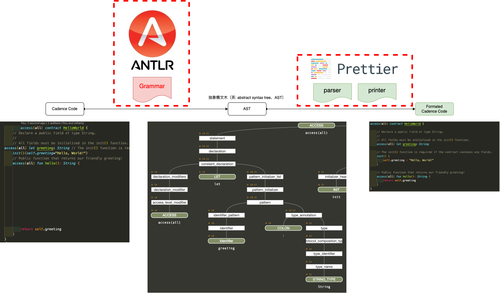

# Purpose （Flow Hackathon 向け）

Flowでは、Flowのリソース志向を実現するための`Cadence`という言語が利用されている。  
この`Cadence`を利用して、スマートコントラクトやそれを実行するためのtransaction、情報取得のためのscriptが書かれている。  
Flowでは、Blockchainでは、実行したトランザクションの透明性確保から、トランザクション署名時にユーザーに実行予定のscriptが表示されるようになっている。  
また、Blockchain上でも、実行予定のスマートコントラクトがどのような内容になっているのかがわかるようにスマートコントラクトのコード自体もリードブルな形でアーカイブされている。  
実行されるトランザクションの透明性確保のための上記取り組みは非常に重要だと考えている。  

しかし、現状、`Cadence`用のCode Formatterが用意されておらず、標準的な整形を行うことができない。  
スマートコントラクト（契約書）は一定の書式を保って管理されるべきであり、せっかくの透明性も、これでは意図的なコードの非整形により下げられる懸念も生じる。  

そこで、本プロジェクトでは、`Cadence`の標準フォーマッターの開発を行う。  
Formatterとしては複数の開発言語でよく利用されている`Prettier`を使用し、PrettierのPluginとしての開発をすすめる。

# image



# Related Project

- [cadence-ast](https://github.com/meganepro/cadence-ast)

# Execute

```sh
npm run example
```